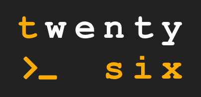

# TwentySix

A simple programming language written by a part-time minimalist

# Writing Code in TwentySix

In TwentySix there are 26 built-in functions each represented by one of the 26 uppercase english alphabet letters. See `DOCS.md` for details.

TwentySix is like assembly; a program begins execution from line one and continues execution line by line unless a `jump` instruction is encountered. A program `halts` if there are no more lines or a halt instruction is encountered.

TwentySix has 26 global variables. Each variable is represented by a single lowercase english letter. Letters `a to w` are dynamically typed values initialized to zero. `x and y` are lists, and `z` is a Hashmap.

A simple hello world program looks like this:

    P 'Hello World'

This program prints `"Hello World"` to the console. Notice, TwentySix accepts only single quotes around strings. Here's a program with a few operations:

    L a A 3 2
    P a

A rough translation into JS might look like this:

    let a = 3 + 2;
    console.log(a);

In TwentySix, we can loop by giving a name to a line and conditionally jumping back to the named line. Here's a program that prints the squares of the numbers from 1 to 10:

    L a 1
    N loop
    I C 10 a H
    P T a a
    L a A a 1
    J loop

TwentySix can get input from std-in. Let's write a program that finds the factorial of a given number (with line numbers):

    1   L n V R
    2   L v n
    3   L r 1
    4   N fact
    5   I E n 1 J done
    6   L r T r n
    7   L n A n F 1
    8   J fact
    9   N done
    10  P U 'The factorial of ' U v U ' is ' r

Let's talk about what's happening on each line. `Line 1`: read a value from std-in, cast to integer, and assign to 'n'. `Line 2`: copy 'n' to 'v'. `Line 3`: set r to 1. `Line 4`: Give a label this line with the name 'fact'. `Line 5`: If 'n' equals 1 jump to 'done' continue to next line. `Line 6`: r = r * n. `Line 7`: n = n - 1 (F flips the value 1 to -1). `Line 8`: Jump to the line with the name 'fact'. `Line 9`: Give name 'done' to this line. `Line 10`: Print out our result using a series of nested concat operations.

# How to Run Code

Install the single node dependency `readline-sync`, which allows TwentySix to read from the console, execute the following command in the same directory as `package.json`:

    npm install

If `program_name.tsix` is your program (in the same directory as make.js), the command below generates the output of your program, and it will pause for input if your program wants to read from std-in:

    node make.js program_name.tsix && node run.js

The command above is split into two parts by `&&`. The first part generates build files in the `output_files` directory. Inspecting these files will reveal how TwentySix has used its `tokenizer`, `lexer`, and `generator` (from the `lib` directory) to translate your program into JS. The second part of the command automatically runs the generated JS.

# Creation Details

TwentySix was designed summer 2019, and the first implementation was written Nov 19.  
